<div align="center">

# IF — Parallel Persona App

**A social matching app where you bring your "what if" to life** — set up a parallel persona, pick the topics that matter, and get matched with people on the same frequency.

[](https://mlbb229229-create.github.io/ifab/)
[](https://mlbb229229-create.github.io/ifab/prototypes/)
[](https://react.dev)
[](https://vitejs.dev)
[](https://tailwindcss.com)

**Dark cosmic UI · red accents · phone-first**

</div>

---

## ✨ Try It Live

| | |
|---|---|
| **📱 [16 HTML Prototypes](https://mlbb229229-create.github.io/ifab/prototypes/)** | Standalone HTML/CSS/JS screens, no build step — click any card to try it. |
| **⚛️ [React App Demo](https://mlbb229229-create.github.io/ifab/)** | The same screens in React: shared state, history-stack navigation, animations, matching flow. |

---

## 1. HTML Prototypes

This UI started as Pencil design specs and was coded into **16 clickable, standalone HTML screens** — no build step, open the file and it runs. Each screen has working micro-interactions: phone login, verification-code flow, persona creation, a star-field home, chat screens, an intimacy meter, a decision assistant and more.

The gallery page ([`prototypes/index.html`](prototypes/index.html)) live-previews all 16 screens in phone frames:

<div align="center">

| | | | |
|---|---|---|---|
| [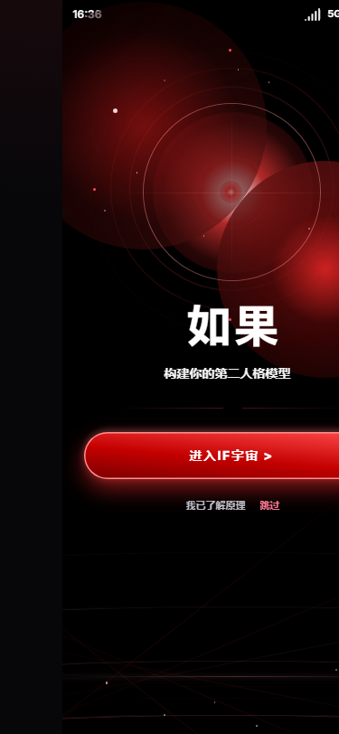](prototypes/01-guide.html) | [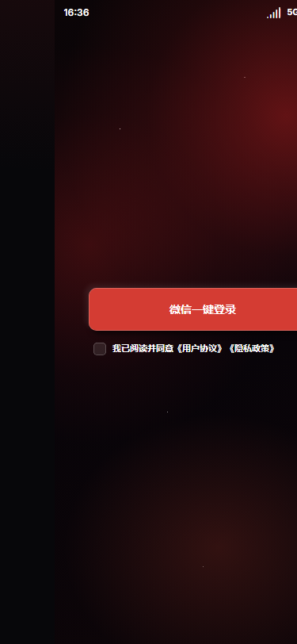](prototypes/02-login.html) | [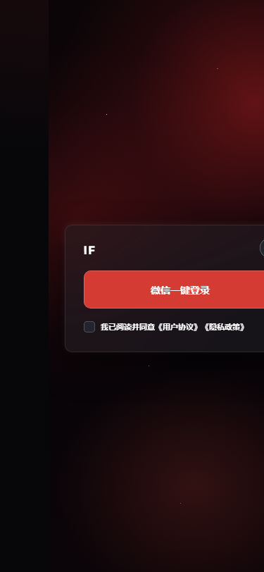](prototypes/login-modal.html) | [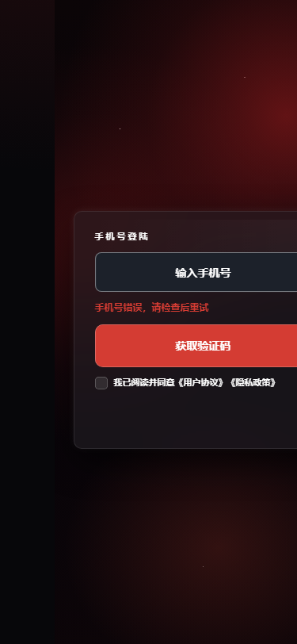](prototypes/phone-login.html) |
| **01 · Onboarding** | **02 · Login & Sign-up** | **03 · Login Modal** | **04 · Phone Login** |
| [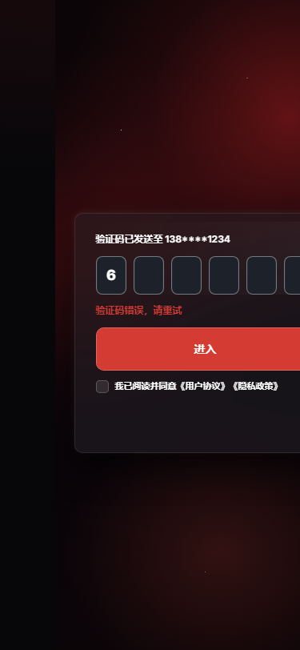](prototypes/verification.html) | [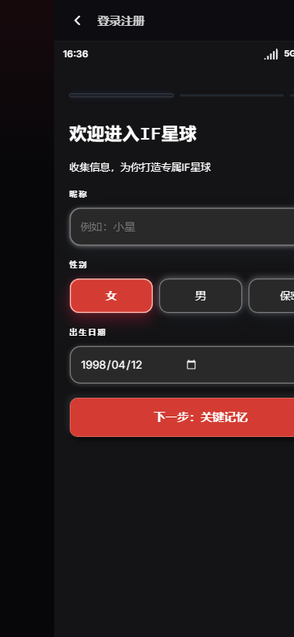](prototypes/03-profile.html) | [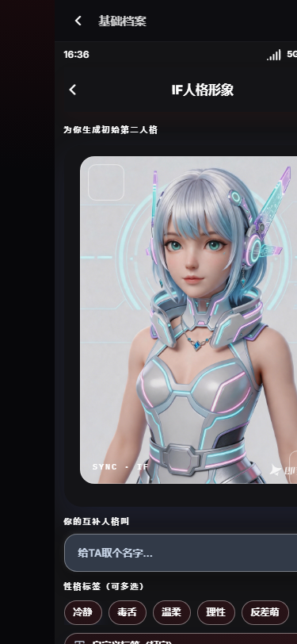](prototypes/04-create-persona.html) | [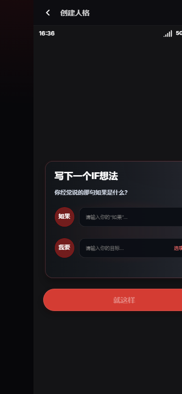](prototypes/06-onboarding.html) |
| **05 · Verification Code** | **06 · Profile Setup** | **07 · Create Persona** | **08 · First-run Onboarding** |
| [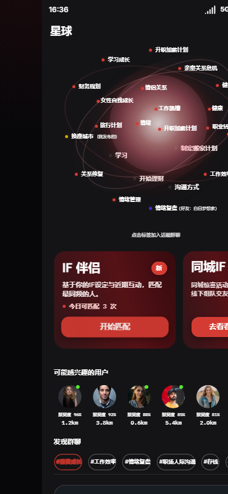](prototypes/07-home.html) | [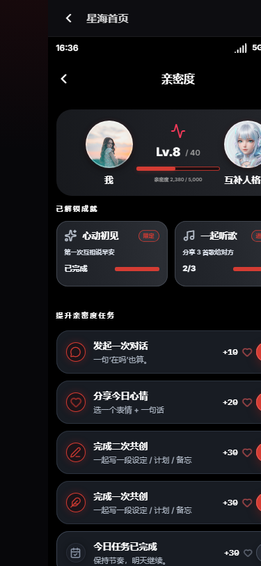](prototypes/intimacy.html) | [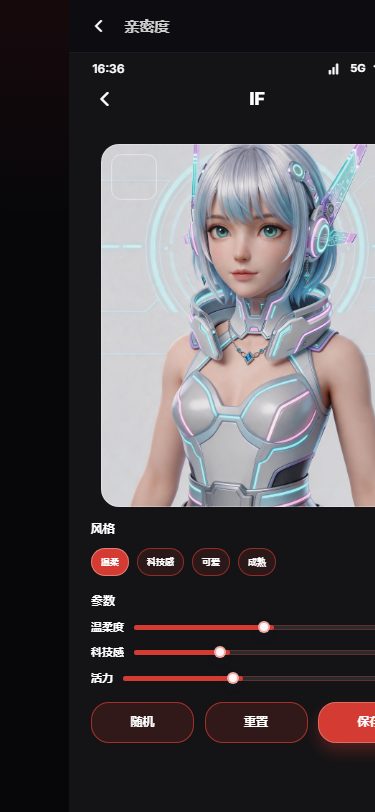](prototypes/ip-settings.html) | [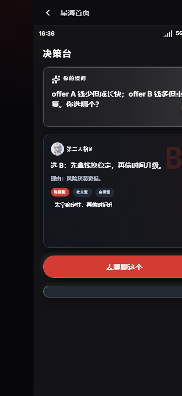](prototypes/08-decision.html) |
| **09 · Home · Star Sea** | **10 · Intimacy Meter** | **11 · IP Settings** | **12 · Decision Assistant** |
| [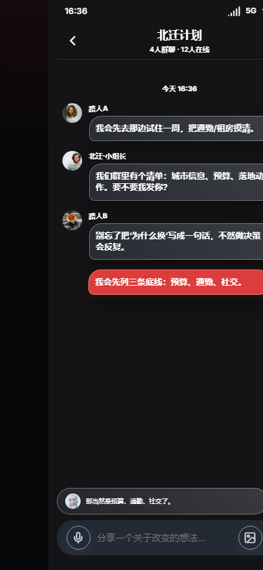](prototypes/group-chat.html) | [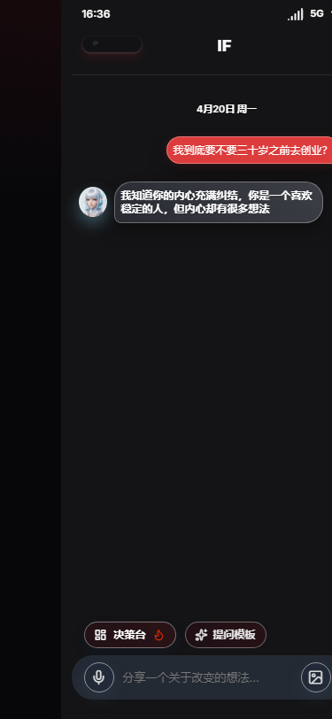](prototypes/persona-chat.html) | [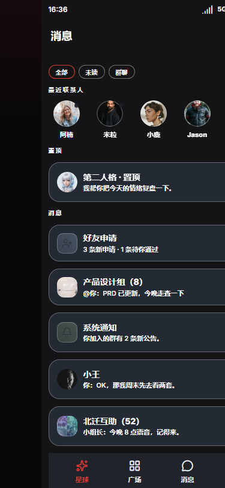](prototypes/messages.html) | [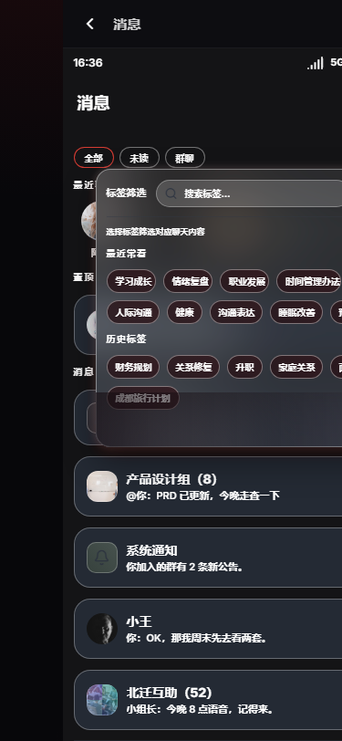](prototypes/messages-filter.html) |
| **13 · Group Chat** | **14 · Persona Chat** | **15 · Messages** | **16 · Messages · Tag Filter** |

</div>

---

## 2. The React Version

The same screens were rebuilt as a **React 18 + Vite 6** mobile-first app with shared state, history-stack navigation, and animations.

<div align="center">
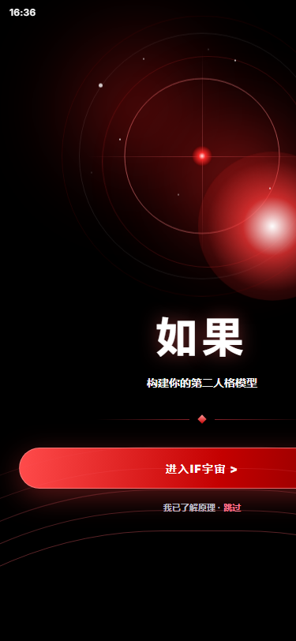
</div>

### Core Features

- **IF Gravity Field (星海)** — the home screen. Your "what-if" tags orbit the center "IF" star; tag distance encodes relevance, with an inertia-based drag, multi-select, and a live matching CTA. Tag distance is computed from a small keyword-relevance score.
- **IF Goal Management** — create, track, and complete "IF" goals with progress sliders, completion states, and auto-suggested group chats per topic.
- **Square (广场)** — a feed with Recommended / Following / Nearby tabs, post composer with multi-image picker (up to 9), geo-tags, and post detail with comments.
- **Matching Overlay** — a full-screen radar-scan → particle-burst match animation with a compatibility score.
- **Messaging** — parallel-persona chat, group chat, and one-on-one chat, with a tag-filter drawer.
- **Intimacy System** — a rising intimacy meter unlocked through tasks, feeding back into the match experience.
- **Decision Assistant** — your second persona helps you reason through real decisions.
- **History-stack navigation** — push/pop navigation with `framer-motion` transitions; all `back` buttons return to the previous screen.

### Tech Stack

| Layer | Choice |
|---|---|
| Framework | React 18, Vite 6 |
| Styling | Tailwind CSS 3, custom CSS animations (rAF-driven star field) |
| Motion | framer-motion |
| Icons | lucide-react |
| State | Lightweight custom store (context) + data layer (`src/data/ifs.js`) |

---

## Repo Structure

```
.
├── prototypes/            # 16 standalone HTML demos — start at prototypes/index.html
├── src/
│   ├── screens/           # 16 app screens (Home, Square, Messages, Me, IF system…)
│   ├── components/        # MatchOverlay, shared UI
│   ├── data/ifs.js        # IF goals, topic pools, relevance scoring
│   └── App.jsx            # history-stack navigation + screen registry
├── docs/screenshots/      # screenshots used in this README
├── public/assets/         # static images
└── .github/workflows/     # GitHub Pages deployment (build → deploy)
```

## Getting Started

```bash
npm install
npm run dev       # start dev server
npm run build     # production build → dist/
```

The HTML prototypes need no setup — just open [`prototypes/index.html`](prototypes/index.html) in any browser (or browse them on the live gallery).

## Deployment

GitHub Actions builds the React app and bundles the HTML prototypes into the Pages site on every push to `main`:

- App → `https://mlbb229229-create.github.io/ifab/`
- Prototype gallery → `https://mlbb229229-create.github.io/ifab/prototypes/`
